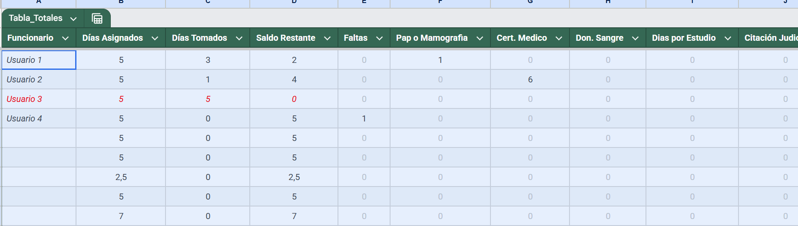
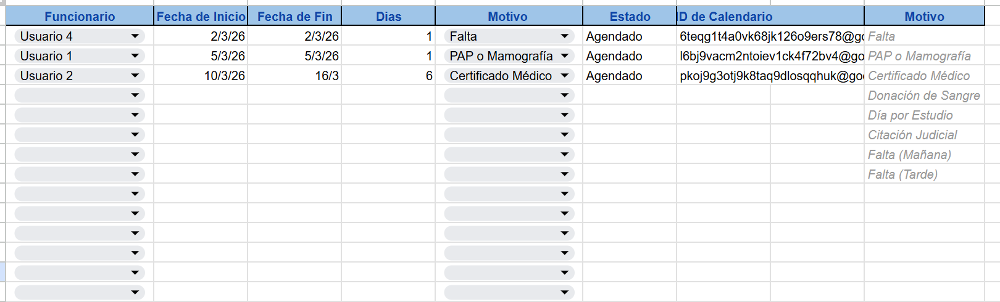
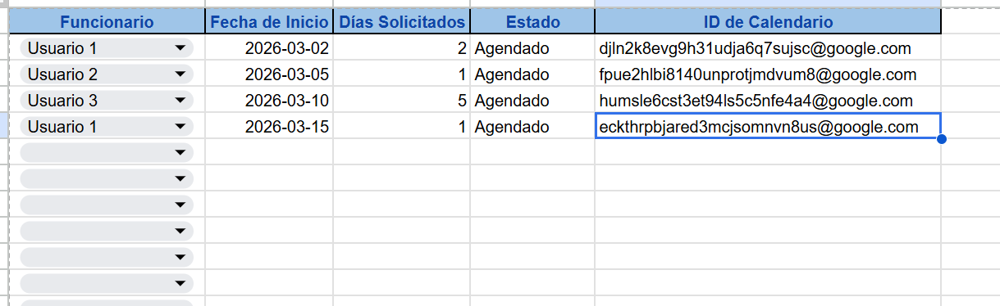
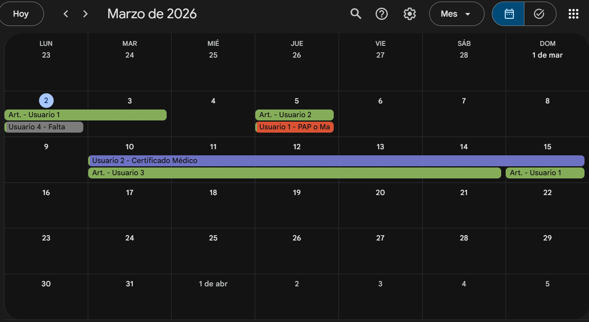
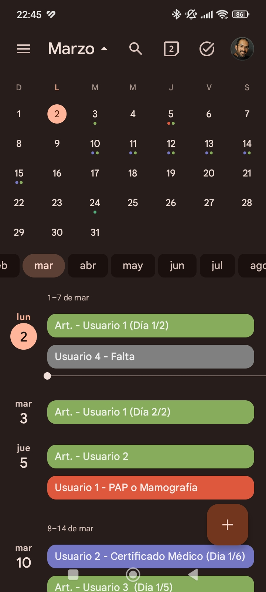

# 📊 Sistema de Monitoreo de Capital Humano & Ausentismo
### Solución de Business Intelligence: Google Sheets + Google Calendar API

## 📌 Escenario y Problemática (El "Dolor")
En un entorno operativo con un volumen considerable de funcionarios, la gestión del ausentismo se realizaba de forma centralizada en una planilla de cálculo estática. 

* **El Desafío:** La falta de visibilidad en tiempo real dificultaba la planificación de coberturas inmediatas.
* **La Limitación:** Los supervisores de área no tenían acceso ágil a la información desde sus dispositivos móviles, lo que generaba cuellos de botella en la toma de decisiones.

---

## 💡 La Solución Implementada
Diseñé un flujo de datos automatizado que actúa como puente entre el registro administrativo y la operativa de campo.

### 1. Capa de Datos (Back-end)
Estructura en **Google Sheets** optimizada con validación de datos para categorizar motivos de inasistencia (médica, licencia, artículo, etc.).

### 2. Capa de Automatización
Implementación de **Google Apps Script** para reflejar automáticamente los registros en un Calendario Compartido. El código se encuentra en el archivo `.gs` de este repositorio.

### 3. Capa de Visualización (Front-end)
* **En PC:** Tablero de control para auditoría y reportes mensuales.

* **Mobile-First:** Disponibilidad de la información en **Google Calendar** para todos los jefes de sector, permitiendo ver quién falta y por qué desde su celular en segundos.

---

## 🚀 Impacto en el Negocio
* **Reducción del tiempo de respuesta:** Eliminación de llamadas y consultas manuales para verificar la dotación de personal.
* **Planificación Proactiva:** Mejora drástica en la asignación de reemplazos y turnos.
* **Transparencia:** Registro histórico auditable para control de gestión y liquidación de haberes.

---
*Proyecto desarrollado por Marcelo Doti | Business Intelligence & Gestión Operativa*

